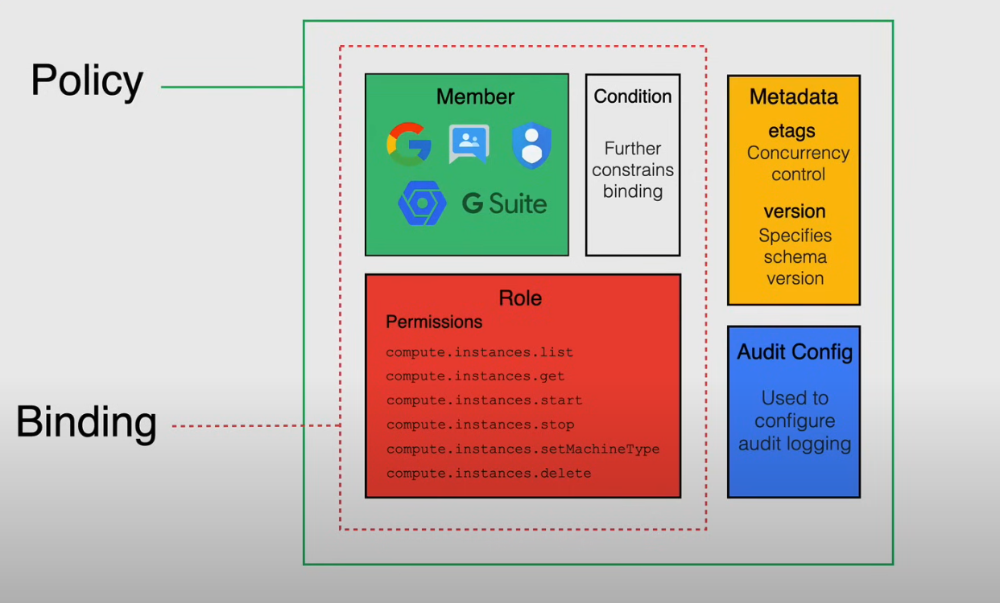
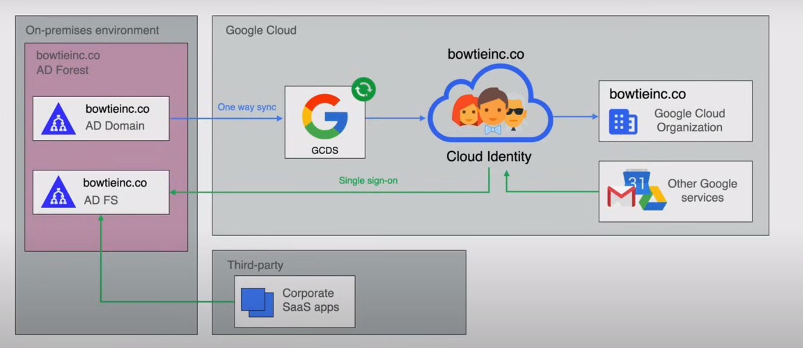

# Identity and Access Management (Cloud IAM)
How permissions are granted and how policies are inherited

## Principle of Least Priviledge 
- A user, program, or process should have only the bare minimum privileges necessary to perform its function
- this principle extends to cloud, hybrid and on-prem environments

## IAM
- **Who** (identity) **has what access** (role) for which resource 
- What roles are granted to which members

### Policy Architecture

- A policy is a collection of bindings, autoconfiguration, and metadata
- Binding specifies how access should be granted on resources
    - binds one or more memebers with a single role and any context specific conditions that restrict how or when a resource should be granted
- Metadata: additional information about the policy
    - etags allow for concurrency control
    - version facilitates policy management
- Audit Configuration: specifies the configuration data of how access attempts should be audited

### Members
- An identity that can access a resource
- the identity of a user is a email address associate with a user, service account, google group, or domain name associated with a G Suite
    - Service Account: an account that belongs to an application
    - Google Groups: a named collection of google accounts
        - can help manage users at scale
        - Groups memebership can manage roles
    - G Suite: google accounts created in an organization's G Suite account
    - Cloud Identity Domain: google accounts in an organization that are not tied to any G Suite applications or features
    - AllAuthenticatedUsers: a special identifer representing all service accounts and users on the internet who have authenicated with a google account
    - AllUsers: anyone on the internett (authenticated or not)

### Roles
- A named collection of permissions that grant access to perform actions on google cloud resources
- Permissions: Determines what **operations are allowed** on a resource
    - Correspond 1-1 with RestAPI methods
    - Not greated to users directly
- You grant roles which contain one or more permissions
    - form: `service.resource.verb`
    - ex `compute.instances.list`
- 3 Types of Roles in IAM
    - Primitive
        - Roles that existed prior to the introduction of IAM
        - Owner, Editor, Viewer
        - Avoid using these roles if possible
    - Predefined
        - Finer grained access control than primitive control
        - created and maintained by Google
    - Custom
        - User defined
        - Allows us to bundle permissions as needed
        - Not updated automatically

### Condition
- A logic expression used to define and enforce, attribute based access control for Google Cloud resources.
- Allow you to choose granting resource access to identities only if configured conditions are met.
    - ex. Can be done to configure access for contracts so that when the contract ends thier access is removed

### Metadata
- etags
    - concurrency control
    - when multiple systems try to write to a IAM policy, this prevents race conditions
- version
    - specifices the schema version
    - version number that is added to determine features such as a condition
    - used to avoid breaking existing integrations on future releases 

### Audit Config
- Used to configure audit logging for the policy
- determines which permission types are logged, and what identity types, if any, are exempt from logging

### Policy Inheritance
- Resources inherit the policies of all thier parent resources
- The effective policy for a given resources is the union of the policy set on that resource and the policies set from higher up in that heirarchy

## Policies and Conditions
JSON Example:
```
{
    "bindings": [
        {
            "role": "roles/storage.admin",
            "members": [
                "user:john@office.com",
                "group:admins@example.com",
                "domain:google.com:,
                "serviceAccount:project-id@appspot.gserviceaccount.com"
            ]
            "condition": {
                "title": "Expires_January_1_2025"
                "description": "Do not grant access after Jan 1 2005",
                "expression": "request.time < timestamp('2025-01-01T00:00:00.000Z')
            }
        },
    ], 
    "etag": "BeEEja0YdWJ=",
    "version": 3
}
```

YAML Example:

```
bindings:
    - members:
      - user:john@office.com
      - group:admins@example.com
      - domain:google.com
      - serviceAccount:project-id@appspot.gserviceaccount.com
      role: roles/storage.admin
      condition:
        title: Expires_January_1_2025
        description: Do not grant access after Jan 1 2025
        expression: request.time < timestamp('2025-01-01T00:00:00.000Z')
etag: BeEEja0YdWJ=
version: 3
```

Useful CLI commands to get the policies:
1. By project: `gcloud projects get-iam-policy <project-id>`
2. By organization: `gcloud organizations get-iam-policy <organization-id>`
3. By folder: `gcloud resource-manager folders get-iam-policy <folder-id>`

### Versions
- Version 1: 
    - No condition statement 
    - supports binding 1 role to 1 or more members
- Version 2:
    - for Google's internal use
- Version 3:
    - condition statment is in the role binding

### Policy Limitations
- 1 policy per resource (including organzations, folders and projects)
- Each IAM policy can contain up to 1500 members
    - 250 of these members can be Google groups
- Changes in policy can take up to 7 minutes to fully propagate across GCP
- Limit of 100 conditional role bindings per policy
- 20 role bindings for the same role and same member

### Conditions
- attributes are either based on resource or based on details about the request (timestampe, originating/destination IP address)
- access allowed if the condition is True (ie. if condition == True)
- possible to restrict access to resources to business hours, or restrict access to dev only environments
- limited to specific services
- primitive roles not supported 
- cannot be applied on AllUsers or AllAuthenticatedUsers

### AuditConfig Logs
- This specifies the audit configuration for a service
    - Determines which permission types are logged
YAML Example:
```
auditConfigs:
- auditLogConfigs:
    - logType: DATA_READ
    - logType: ADMIN_READ
    - logType: DATA_WRITE
    service: allServices
- auditLogConfigs:
    - exemptedMembers:
        - john@example.com
        logType: ADMIN_READ
    service: storage.googleapis.com
```

## Service Accounts
- Account that is used by a application or VM instance
- A special kind of Google account intended to represent a non-human user that needs to authenticate, and be authorized, to use google APIs
- Identified by its unique email address
- 3 different service account types:
    - User Managed
        - User created
        - You manage and secure the account
        - You choose the name
            - `service-account-name@project-id.iam.gserviceaccount.com`
    - Default
        - using some GCP services create user managed service accounts
        - automatically granted the Editor role for the project
        - Google recommends that you revoke the Editor role or auto revoking the editor role to follow the principle of least priviledge
        - Named:
            - `project-id@appspot.gserviceaccount.com`
            - `project-number-compute@developer.gserviceaccount.com`
    - Google Managed
        - created and managed by Google and used for Google services
        - some are visible and some are hidden
        - Names end with "Service Agent" or "Service Account"
        - Not recommended to change or revoke roles for these accounts
        - Name:
            - `project-number@cloudservices.gserviceaccount.com`

- Authentication of Service Accounts (service account keys)
    - 2 sets of public and private RSA Key pairs
        - Google managed keys:
            - google stores public and private portion of the key
            - rotates them regularly
            - private key held in escrow
            - never directly accessible
        - User managed keys:
            - you own both the public and private portions of the key pairs
            - Google stores the public portion of a user managed key
                - You handle private key storage, security, and rotation
            - Google recommends storage on Cloud KMS

- Service Account Permissions:
    - Service accounts are resources with IAM policies attached to it that determines who can use the service account
- `ServiceAccountUser` Role
    - Project Level: gives the user access to all service account in the project, including future service accounts
    - Service Account Level: gives a user access to only that service account
- Access Scopes: are the legacy method for specifying permissions for your instance
    - a default service account will use Access Scopes instead of IAM roles
    - used in substitution for IAM roles

### Using a service account
- Attach/Bind the service account to a resource
- Impersonation

### Best practices for service accounts
- Audit service accounts or keys using either the `serviceAccount.keys.list()` method or the Logs Viewer page in the console
- Delete service account external keys if they are not needed
- Grant service account the minimum set of permissions
- Take advantage of IAM service account API to implement key rotation

## Cloud Identity
- Google's Identity as a Service (IaaS) solution
- Centrally manages users and groups
    - Authentication and SSO experience
- User and group management
- Configure cloud identity to federate identity between google and other identity providers
    - such as active directory and Azure Active Directory

### Device Management
- People in any organize access thier work accounts from mobile devices in a secure way
- The device can be wiped from all it's corporate data when not being used by the company anymore

### Security
- 2 step verification:
    - verification throught something they know + something they have
        - ex. password + security key

### Single Sign-On (SSO)
- users can access many applications without having to provide username and passwords for all applications
- Google can work as the identity provider and can give a dashboard to all the applications that login provides access for
    - OKTA provides a similar solution

### Reporting
- AuditLogs for logins, groups, devices and token
- Can export logs to BigQuery for analysis


### Directory Management
- Provides profile information for users in the organization
- Google Cloud Directory Sync (GCDS) allows syncing with Microsoft Active Directory

**Google Cloud Directory Sync (GCDS)**
- Active Directory (Microsoft service)
    - Auth for all users and computers in a Windows domain type network
    - Updating software as necessary
- Active Directory Forest contains:
    - The heirarchical structure for AD
    - AD Domain: responsible for storing info about members of the domain
    - AD Federation Services (ADFS): a SSO service to link electonic indentity across distinct identity management systems
        - Sexurity Assertion Markup Language (SAML), OAuth, OpenID, JWTs (JSON web tokens)

- The sync allows you to automatically provisions users and groups to Google Cloud (can be run in Google Cloud or On-Prem)
- Free Tool


## Cloud IAM Best Practices
### Principle of Least Priviledge
- Minimal level of access required for whats needed
- Predefined roles over primitive roles
    - more granular
- Grant roles at the smallest role necessary
- Child resources cannot restrict access granted on it's parent
- Restrict who can create and manage service account
    - Service account actor will have access to all resources the service account has
- Be cautious of owner roles

### Resource Hierarchy
- Mirror your Google cloud resource heirarchy structure to you organizations structure
- Use projects to group resources that share the same trust boundary
- Set policies at the org level and the project level rather than the resource level
- Use security principle of least privilege to grant IAM roles
- Grant roles for users and groups at the folder level instead of project level, if **spanning across multiple projects**

### Service Accounts
- When using service accounts, treat each app as a separate trust boundary
    - Create a new service account when multiple accounts are involved in creating your application
- Do not delete service accounts in use by runnning services (schedule during planned downtimes)
- Rotate user managed service account keys 
    - Create a new key, switch app to new key, then delete the old key
- Name service account keys to reflect use and permissions
- Restrict service account access to **only** those who need it
- **Don't check in service account keys to source code or leave in downloads directory**
    - This can compromise an entire environment

### Auditing
- Check Cloud Audit Logs to regularly audit IAM policy changes
- Check who has editing permissions on IAM policies
- Export audit logs to Cloud Storage for long-term retention
- Regularly audit service account key access
- Restrict audit logs to only those who need access
    - Others should not be able to view them

### Policy Management
- To grant access to all projects in a Org, use organization-level policy
- Grant roles to a Google group instead of individual users when possible
- When granting muliple roles to a particular task, create a Google group instead