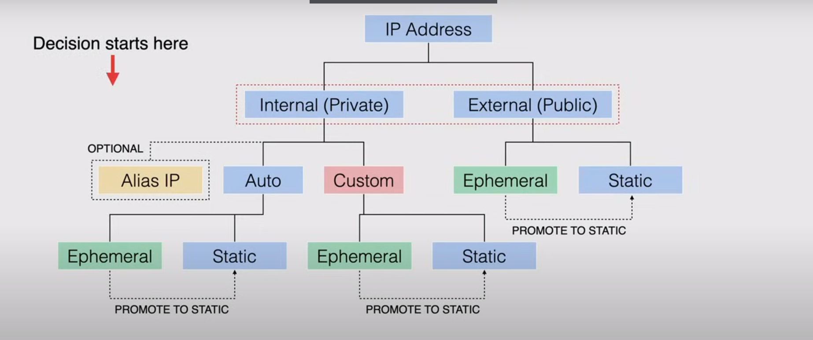

# Networking Services
## Networking Refresher
### Open Systems Interconnection Model (OSI)
| Layer | Name | Protocol
| ---   | ---  | --- |
| 7 | Application | HTTP, HTTPS, DHCP, DNS, SSH, Telnet|
| 6 | Presentation | |
| 5 | Session | |
| 4 | Transport | TCP, UDP (IP packets)|
| 3 | Network | IPv4, IPv6 (IP subnet addresses)|
| 2 | Data Link | |
| 1 | Physical | | 
- This model facilitates the communications between computers

 **Network**
 - Two versions of the Internet Protocol
    - Classless Inter-Domain Routing (CIDR)
        - 192.168.0.0/16
        - CIDR ranges are represented by the starting IP address (192.168.0.0)
            - Called the network address
        - /16 is called the prefix
            - Represents the network
            - Bigger number = smaller network
            - Smaller number = bigger network
    - IPv4
        - Dotted Decimal System
    - IPv6
        - New, and deals with address exhaustion in IPv4 (IP's were being used up)
        - Hexadecimal notation for network address
        - 8 Hextexts
        - 1452:0db8:0:0:0:fe02:0042:8452
        - Groups of zeros (0000) become 0
        - zeros next to each other become ::
            - 1452:0db8::fe02:0042:8452
        - Has a network address + prefix
            - 2001:de3::/64

**IP References**

**fixed portion bold**
| IP | IP Addresses | 
| --- | ---|
| **192**.168.0.0/8 | 16+ million | 
| **192.168**.0.0/16 | 65,536 | 
| **192.168.0**.0/24 | 256 | 

**Transport Layer**
- Packet is the basic unit of information in network transmission
- TCP - Transmission Control Protocol
- UDP - User Datagram Protocol
- `Source IP + Destination IP + Protocol Port Number + Data`

**Application Layer**
- Applications use the protocols in this layer to functions
- HTTP(S)
- DNS (UDP-Port 53)
- SSH (Port 22)

## Virtual Private Cloud (VPC)
- Service that allows you create networks inside Google cloud with both private and public connectivity options
- Works with both Cloud and Hybrid deployments
- Virtualized network within Google cloud
- Software defined network (abstracted system)
- A VPC is a Global resource
- Encapsulated in a project
    - the logical container in which a VPC lives
- VPCs have no IP address ranges associated with them
- Firewall rules control traffic flowing in and out of the VPC
    - Rules are implemented on the VM themselves
- Resources within a VPC can communicate with one another by using internal (private) IPv4 addresses
- VPCs only support IPv4 addresses
- Each new project starts with a **default network** in a VPC
    - Auto mode network with predefined subnets
    - A subnet is allocated for each region, with non-overlapping CIDR blocks
    - Each default network has a default firewall rule to allow ingress traffic for ICMP, RDP, SSH and traffic within the default network for all protocols and ports
- 2 types of VPC networks:
    - Auto Mode:
        - Has 1 subnet per region
        - Use a set of predefined IP ranges with a /20 CIDR block (can be expanded to /16)
    - Custom Mode:
        - Does not automatically create subnets
        - Provides complete control over subnets and IP ranges
        - Recommended for production requirements, more flexible

- VMs can communicate across Regions so long as they are in the same network
    - can communication using in-network protocols
- If your VMs are in the same region but different networks they will need to communication over external IPs

Default VPC subnet configuration

- Command to expand VPC address range for a subnet
    - `gcloud compute networks subnets expand-ip-range default --region=us-west1 --prefix-length=16`
- verify subnet changes
    - `gcloud compute networks subnets describe default --region:us-west1`

---
### VPC Network Subnets
- When you create a resource in Google Cloud, you choose a network and a subnet
- Each VPC network consists of one or more useful IP range partitions called subnets each subnet is associated with a region
- Custom VPCs start with no subnets giving you full control over subnet creation
    - You get to create one or more subnets per region
- The name or region of a subnet cannot be changed after you have created it
- Primary and secondary ranges for subnets cannot overlap with any allocated range
- Increasing subnet IP space
    - Can be done with no workload shutdown or downtown
    - new subnet must not overlap with other subnets in the same VPC network in any region
    - new subnets must stay in RFC 1918 address-space
    - network range must be larger than the original
    - once a subnet has been expanded, you cannot undo it
    - /20 -> /16 (one way conversion)
- Reserved IP Addresses:
    - every subnet has 4 reserved IP addresses in its primary IP range (first 2 and last 2 in the CIDR range):
        - Network - First Address
        - Default Gateway - Second Address
        - Google Cloud Future Use - Second to Last Address
        - Broadcast - Last Address

## Routing and Private Google Access
*How traffic is routed in Google Cloud for editing or building new routes*
- Routes define the network traffic path from one destination to another
- In a VPC network, a route consists of a **single destination (CIDR)** and a **single next hop**
    - when an instance in a VPC network sends a packet, GC delivers the packet to the next hop if the packets destination address is within the routes destination range
- All routes are stored in a routing table for the VPC
    - A data table listing the routes to particular network destinations

### Routing Types
- 2 types:
    - System-generated:
        - Default
            - Path to the Internet
            - Path for Private Google Access
            - Can be deleted only by replacing with custom route
            - This is the lowest priority, because the destination is the broadest possible
        - Subnet Route
            - Routes that define paths to each subnet in the VPC
            - Each subnet has at least one subnet route whose destination matches the primary IP range of the subnet
            - When a subnet is created, a corresponding subnet route is created for both the primary and secondary IP range
            - You cannot delete the subnet route unless you modify or delete the subnet
    - Custom Routes
        - Static Route
            - can use the next hop feature
            - can be created manually
            - static routes for the remote traffic selectors are created automatically when creating Cloud VPN tunnels
            - Params:
                - Name
                - Description
                - Network (VPC network it is associated with)
                - Destination IP Range (a IPv4 CIDR block)
                - Priority
                    - Which routes should be used (low num = high priority)
                - Instance tags
                - Next hop 
        - Dynamic Route
            - Managed by one or more **Cloud Routers**
            - Allows us to dynamically exchange routes between a VPC and on-premises networks
            - The destination IP ranges are always *outside the VPC network*
            - used with dynamically routed VPNs and Interconnect

### Routing Order
- Subnet routes are always first, because Google cloud requires subnet routes to have the most specific destinations
- If no applicable destination is found, GC will drop the packet
- Special Routes used for certain services: Special Return Paths
    - Routes defined outside of VPC networks defined in the production network for Google
    - Traffic controlled through firewall rules
    - services covered: load-balancers, internet aware proxy (IAP), Cloud DNS

### Private Google Access
- VM instances that only have internal IP addresses can use Private Google Access allowing them to reach external IP addresses of Google APIs and Services outside of the VPC
- Can also get private access:
    - Private google access for on-prem hosts through Cloud VPN tunnel or Cloud interconnect
    - Private Services Access (VPC network peering connection)
    - Serverless VPC Access (through internal VPC connection)

## IP Addressing
- Determined by Internal and External communication that applies to your resources

### Internal IP Addressing
- Not public advertised, and used only within a network
- Every VPC has at least one internal address range
- Resources with internal IP addresses communicate with each other privately
- Alias IP allows you to configure multiple internal IP addresses representing  containers or applications hosted in a VM, without using a separate network interface
    - Alias IP ranges can be assigned from the subnets primary or secondary ranges
    - Allows you to have multiple IP addresses to a network interface, each IP serving a different purpose
- When choosing Auto or Custom mode VPC you have 2 IP choices:
    - Ephemeral: Does not exist beyond the life of the resource, can be updated to static
    - Static: persists in the project until explicitly released

### External IP Addressing
- Can assign an external IP address to an instance or forwarding rule if you need to connect to the internet, resources in another network, or a public Google Cloud service
- Sources from outside a Google Cloud VPC network can address a specific resource by the external IP address
    - firewall rules must enable the connection
- Only resources with an external IP can send and receive traffic directly to and from outside the network
- Also have Ephemeral and Static IP Address options:
    - Ephemeral: Auto assigned, released with resource deletion or stopped
    - Static: Assigned to a project long term until explicitly released, available as a region or global resource
        - useful for web server or global load-balancer that needs access to internet

### Internal IP address reservation
How to create:
1. reserve a specific address and then associate it with a specific resource
2. specify an ephemeral internal IP address for a resource and then promote the address (promotion to static internal)

Two options for external IP addresses:
- Regional IP address
    - can be used by VM instances with one or more network interfaces or network load balancers
    - `gcloud compute addresses create ADDRESS_NAME \ --region REGION`
- Global IP 
    - used for global load balancers
    - `gcloud compute addresses create ADDRESS_NAME \ --global \ --ip-version [IPV4][IPV6]`
    - must choose premium network service tier (more expensive)

## VPC Firewall Rules
**IMPORTANT TOPIC FOR THE EXAM**
- Allow or deny connections to or from VM instances based on a configuration you specify
- These rules apply to either incoming or outgoing connections but **not both** at the same time
- Every VPC network functions as a distributed firewall, when firewall rules are defined at the network level, connections are allow or denied on a per instance basis

- When creating a VPC firewall rule, you specify a VPC network and a set of components that define what a rule does
    - Allow you to target certain types of traffic based on the traffics
        - Protocol
        - Ports 
        - Sources
        - Destinations

### Implied and pre-populated rules
- Google Cloud does not allow certain IP protocols such as egress (outgoing) traffic on TCP: Port 25 within a VPC network
- Protocols **other** than TCP, UDP, ICMP, and GRE are blocked 
- Allows communication between a VM instance and it's corresponding metadata server at address: 169.254.169.254
    - Server is essential to the operation of the instance so the server can access it regardless of any firewall rules configured
    - Provides basic services to the server such as DHCP (dynamic host configuration), DNS (domain name system), Instance Metadata, and NTP (network time protocol)

- Every network has 2 implied firewall rules to permit outgoing connections and block incoming connections:
    - allow egress rule: we allow a destination of IPs
    - deny ingress rule: the source is all IPs, lowest possible priority
    - firewall rules we create can override these rules

### Firewall Rule Characteristics
1. Each firewall rule applies to incoming or outgoing connections and not both
2. Firewall rules only support IPv4 connections
    - Source for Ingress Rule or Destination for Egress rule must be IPv4 or IPv4 block in CIDR notation
3. A firewall rule is either allow or deny and not both at the same time
    - applies to connections as long as it is enforced
    - can disable a rule for troubleshooting  purposes
4. When creating a firewall rule you must select a VPC network
    - Rule enforced at the instance level but it is configured for a VPC network
    - You cannot share firewall rules among VPC networks
5. Firewall rules are stateful
    - When a connection is allowed throughout the firewall in either direction, return traffic through the network is also allowed
    - Cannot config a firewall rule to deny associated response traffic
    - The return traffic is the same 5-tuple as the request but reversed (except the protocol)
        - a 5-tuple consists of the source IP, source port, destination IP, destination port, and the protocol used
6. Google cloud associates incoming packets with corresponding outbound packets through a connection tracking table
    - implemented regardless of if the protocol allows connections

### Firewall rule components
- Network
    - Network you want the rule to apply to
- Priority
    - numerical priority to determine if the rule is applied (lower number = higher priority)
- Direction (ingress or egress)
- Action on match (allow or deny)
    - permits or blocks the connection
- Targets
    - defines to which instances the rule applies
    - specified using:
        - all instances in the network
        - instances by target tags (matching network tag)
            - a character string added to a resource
        - instances by target service accounts
- Source Filter
    - **source** for ingress rules or **destination** for egress rules 
    - specified using:
        - Source IP ranges either inside or outside Google Cloud
        - Source Tags
        - Source Service Accounts
- Protocols and Ports
    - You can specify a protocol or combination or their protocols and ports 
    - If omitted, the firewall rule is applicable for traffic on any protocol and any port
- You can also enable and disable the firewall rule when you want in the components page (enabled when created)

## VPC Peering
How you can privately communication across VPC in the same or different organization and same of different projects
### Advantages of VPC Peering over External IP Addressed and VPNs
- Reducing network latency
    - All traffic stays within Googles high speed network
- Increases network security
    - Is not exposed to the public internet
- Reduces network costs
    - Save on egress costs for traffic leaving the VPC
        - You are charged for traffic communicated using public IPs

### Properties and Characteristics of Peered VPCs
1. Peered VPCs remain administratively separate
    - Routes, Firewalls, VPNs are applied separately
    - Each side of a peering association is established separately
    - Each VPC must have matching configuration to peer
2. VPC peers always exchange all subnet routes
    - You also have the option of changing custom routes
3. A given VPC network can peer with multiple VPC networks but there is a limit
4. Restrictions:
    - A subnet CIDR range in one VPC network cannot overlap with with a static route in another peered network
    - When creating a new subnet in a peered VPC network, VPC network peering doesn't provide granular route control
        - these are handled by firewall rules
        - Ingress Allow Firewall rules
        - By default, ingress traffic to VMs in blocked by the deny ingress rule
    - Transitive peering is **NOT** supported
        - network-a -> network-b -> network-c not allowed
        - network-a must be directly peered with network-c
    - You cannot use a tag or service account for one peered network in another peered network
    - Internal DNS is not accessible for Compute Engine in peered networks as they must use an IP to communicate

## Shared VPC
When a VPC is created it is usually tied to a project, what if we want to share resources across different projects but still have separate billing and access within the projects themselves?
### Characteristics of a Shared VPC
- Shared VPCs allow an organization to connect resources from multiple projects to a common VPC network
- They can communicated with each other securely and efficiently using internal IPs from that network
- When using shared VPCs you designate a project as a host project and attached one or more other service projects to it
    - A project that participates in a shared VPC network is wither a host project or a service project
        - A host project can contain one or more shared VPC networks
        - A service project is any project that is attached to a host project by an admin
        - A project is either host or service, but not both
        - It is common practice to have multiple service projects administered by different departments or teams in the org
- A project not in a VPC is considered a standalone project
- Always adhere to Principle of Least Privilege
### Roles needed for Shared VPC
- Shared VPC Admin: permissions to enable host projects, attach service projects, and delegate access to some or all subnets to service project admins
- Service Project Admin: a shared VPC admin for a given host project
    - Project-Level permissions:
        - a service project admin that can use all subnets in the host project
    - Subnet-level permissions:
        - a service project admin that can use only some subnets

### VPC Example Use Cases
Shared VPC Network

Multiple Host VPC Network

Hybrid VPC Network

Two-tier web service

## VPC Flow Logs
Records a sample of network flows received by and sent from VM instances, includes GKE instance nodes. Used for network monitoring, forensics, security analysis, and expense optimizations. When enabled these are enabled for all VMs in a subnet.
- Logs can be exported to Stackdriver (only 30 days)
- Logs can exported to Cloud Storage if needed to keep for longer retention
- The sampling rate is locked (about 1 in every 10 captured)

### Use Cases
- Network Monitoring 
    - Real-time visibility into network throughput and performance
- Analyze network usage and optimize network traffic expenses
- Network forensics when incidents occur
    - Check compromised IPs
- Real time security analysis
    - Stream to Pub/Sub and integrate with applications like Splunk

### Record Format
Recorded in a specific format:

Core Fields

| Base | IpDetails| Additional Fields | 
| ---- | ---- | ---- | 
| connection | src_ip | src_instance | 
| start_time | src_port | dest_instance |
| end_time | dest_ip | src_vpc | 
| bytes_sent | dest_port | dest_ vpc | 
| packets_sent | protocol | src_location | 
| rtt_msec | | dest_location |
| reporter | | src_gke_details |
| | | dest_gke_details |

- you can get the flow logs from Logs Viewer using the sub-network filter and looking for the compute.googleapis.com/vpc_flows

## DNS Fundamentals (Domain Name System)
Used in Google Cloud from an infrastructure perspective.
- This is a global decentralized distributed database to store IP addresses and other data and look them up by name
- Uses human readable names (google.com) and translates it to an IP address (172.217.164.196)
- Allows the web browser to know where to connect to on the internet
- This is the core of communicating between devices on the internet
### How does DNS work?
- We gave names to IP addresses
- The DNS db converts the readable name to an IP address
    - Stored in a logical container called a Zone in a Zone file
    - The DNS record links the name with the IP address
    - The Zone file is hosted by a Nameserver

## DNS Record Types
DNS recourse records are the basic information elements of the DNS, they are entries in the DNS db that provide information about the host. Typically stored in the zone files on the server.
### Name Server Records (NS)
- identifies which DNS server contains the records for domain
- usually found at registrar, internet service provider, or hosting company
### A and AAAA Records (Address Records)
- IPv4 (A) and IPv6 (AAAA) records
- The A record information links the website domain to an IPv4 address that points to the server where the website files live
- AAAA record is the IPv6 for the same thing
- Multiple domains can point to the same address
    - each would have its own A or AAAA record
### CNAME Records (Canonical Name Record)
- Maps one domain name to another
- Good for running different service (eg ecommerce and FTP running on different ports from a single IP)

### TXT Records (Text Record)
- A record to provide text information to sources outside your domain that can be used for many purposes
- Can be human or machine readable text (helps to verify ownership)

### MX Records (Mail Exchange)
- Directs email to a mail server
- How to route email messages and to which server it should go to
- a MX record always points to another domain
- Consists of 2 parts:
    - Priority: The preference for order in which the mail servers should be used (lower number = higher priority)
    - Domain Name
### PTR Records (Pointer Records)
- Provides the domain name associated with an IP address
- Used in reverse DNS lookups (matches an IP address to the domain name)
    - end in: in-addr.arpa
    - ex. 195.92.54.52.in-addr.arpa PTR google.com

### SOA Records (Start of Authority Records)
- Created for you when you create your managed zone
- Contains the core information about your zone
- One SOA per zone
- Can reduce bandwidth between Nameservers, increase the speed of website access, and ensure the site is alive every when primary DNS is down

## Network Address Translation (NAT)
### What is NAT?
- A way to map multiple local private IP(s) to public IP(s) before transferring packets
- Done by altering the network address data in the IP header of the data packet while traveling toward the dest
- As packets pass NAT device, src or dest IP address is changed
- Designed to deal with scarcity of free IPv4 addresses
- IPv6 networks do not require NAT because the is no scarcity of addresses
- NAT adds security and privacy
    - Hides your IP address of your device from the outside world
    - Only allows packets to be sent and received from the originating device

### Types of NAT
- Static NAT - maps 1 private IP to 1 public IP (1 to 1 mapping)
- Dynamic NAT - maps 1 private IP to 1 public IP in a pool of public addresses
    - Public address is allocated as needed
- Port Address Translation (PAT) - Maps multiple private IPs to 1 public IP
    - Usually what home routers use
    - Uses ports to distinguish devices
    - Method used for Cloud NAT in Google Cloud

### Static NAT
- The NAT device maps the private IP to a public IP in a NAT table
    - 192.168.0.15 <-> 73.6.2.33
    - This allows the private IP device to communicate on the public internet with devices that have a public IP

1. Packets are generated with the private source IP and the public destination IP in the header
2. The packet will go to the router (NAT device). The source address in the packet is translated from a private IP to a public IP and the source in the packet is delivered as a public IP
3. When the destination responds with the data using the translated source public IP address
4. The NAT device will check the table and make a translation to the destination IP address translating it from the public IP to the required private IP

### Dynamic NAT
- Similar to static NAT except the device on the private network are not allocated a permanent public IP
- The mapping is allocated based on the a pool of public IPs the NAT device has available 
- No new connections are are allowed if all public IP addresses are allocated 
    - If you have the same number of devices at IPs in the public pool you will not run into this problem

### Port Address Translation or NAT overload (PAT)
- Typically used on Home networks
- Allows a large number of private devices share one public IP addresses
- Private Address:Public Address is a Many to One relationship 
- Uses both the IP addresses and ports to use the same public IP
    - The src port is randomly assigned by the client
    - If the src port is unique then many devices can use the same IP address
- The port is ephemeral randomly assigned port
- The NAT device will allocate a public IP and src port 

NAT Table
| Private IP | Private Port | Public IP | Public Port |
| ---- | ---- | ---- | ---- |
| 192.168.0.13 | 35535 | 73.6.2.33 | 8844 | 
| 192.168.0.14 | 35536 | 73.2.33 | 8845 | 
| ... | ... | ... | ... |

- NAT device records the src IP and src port in the NAT table
- src IP and source port is replaces with public IP and public port

## Cloud DNS
- This a fully managed service that manages DNS servers for your specific zones
- Acts as an authoritative DNS server for public zones that are visible to the internet and private zones that are visible only to your network
- This is a Globally Resilient Service
- You cannot select your regions to deploy your zones and server policies
- Offers 100% availability and low latency
- Host zones through managed name servers
    - you can register a domain name through Google Registrars
    - To create private zones you don't have to purchase Domain names
- Offers the ability to host public zones and and private managed DNS zones
    - Public Zone is visible to the public internet
    - Private Zone is visible only within your network
        - you can manage custom domain names for your Google Cloud resources 
- A Zone is a container of DNS records that are queried by DNS

### Managed Zones
- Each zone created is associated with a Google Cloud project
    - hosted by googles managed name servers

