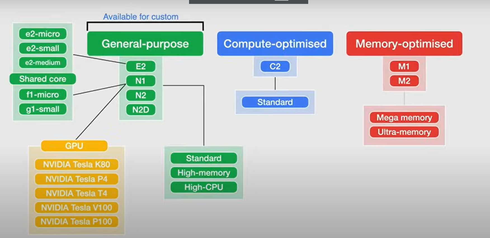
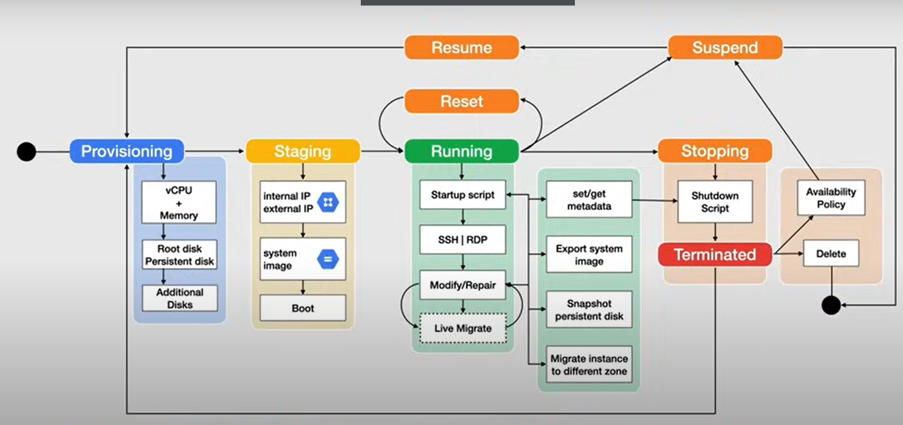

# Section 5: Compute Engine

## Virtualization Fundamentals
How does Compute Engine get it's features under the hood and how they are possible through virtualization.
### What is virtualization?
The process of running multiple operating systems (OS) on a server simultaneously

- The Hypervisor (VMM) layer is a small software layer between the hardware and OS layers that enables multiple OS's to run alongside each other sharing the same physical computing resources without each operating system having to run with privileged access to the hardware
- The operating systems come as Virtual Machines (VMs): files that mimic entire computing environments in software
- The Hypervisor aka Virtual Machine Monitor manages the VMs as they run alongside each other
    - assigns each VM a slice of the underlying computing resources (CPU, GPU, etc)

### Kernel Level Virtualization
- The kernel will act as the Hypervisor
- Runs a separate version of the linux kernel and sees the associated virtual machine as a user space process on the physical host
- A device driver is used for communication between the main linux kernel and the VM
- Every VM is implemented as a regular linux process, scheduled by the linux scheduler, with dedicate virtual hardware like a network card, graphics adapter, CPU, memory, and disk
- A specialized form of server virtualization
- This is the virtualization platform that is used in all of Google Cloud
- Nested Virtualization: on the VM's OS you run another hypervisor and OS
    - Why do this?
    - makes it easier to move their on prem virtualized workloads to the Cloud without having to import and convert VM images

## Compute Engine Overview
- Lets you create and run Virtual Machines aka Infrastructure as a Service (IaaS)
- Has multiple instance sizes and types
- Per second billing
    - consumption based model
- Launched in a VPC network
- Host is available in a Zone
- option of multi-tenant host or sole-tenant host
    - each instance is isolated from another in multi-tenant

### Machine Configuration
| Cores      | Operating System | Storage        | Networking |
|------------|------------------|----------------|------------|
| Predefined | Public Image     | Standard (HHD) | Default    |
| Custom     | Custom Image     | Balanced (SSD) | Custom     |
|            | Marketplace      | SSD            |            |

- Predefined Machine Types
    - General, Compute, Memory
    - Intel or AMD
    - vCPU = single hardware hyper-thread on CPU
        - you need to consider the desired network throughput
        - Network throughput = 2 Gbps per vCPU

- Operating Systems
    - You must use a OS image to create boot disks for your instances 
    - Public Image - Linux or Windows
    - Custom Images - Private images (snapshots or existing disk)
        - incur a image storage chare
    - Marketplace - OS + Software
        - You can startup a software package without the configuration

- Storage
    - Performance vs Cost
        - pay less and have slower disk speed
        - pay more for fast disk speed
    - Standard
        - spinning hard drive
    - Balanced (SSD)
        - Solid State Drive backing
    - SSD
        - fastest option with highest Iops 
    - Local SSD
        - SSDs that are physically attached to server
        - The data persists only until instance stopped or deleted

- Networking
    - Each network interface of a compute engine instance is associated with a subnet of a unique VPC network
    - Can be a auto, default, or custom network
    - Many available regions or zones
    - Ingress/egress firewall rules (IP ranges, tags, instances)
    - Network load balances
        - distribute user traffic across multiple instances
        - can be regional or global load balancers
        - help route and manage traffic

## Compute Engine Machine Types



### Machine Types
- Machine types naming convention are broken into 3 parts (e2-standard-32):
    - series -> (e2) number is the generation
    - type -> (standard) memory, cpu optimized, etc
    - vCPUs -> (32) the number of vCPUs
    - GPUs are available only for the N1 series

### General-purpose family

- includes c, e, n, tau series
- all available in standard, high-memory, and high-cpu types

#### E series

- generations available: E2
- day-to-day computing a a lower cost
- use cases:
  - low-traffic web servers
  - back office apps
  - containerized microservices
  - virtual desktops
  - dev environments
- lowest on-demand pricing
- 2 - 32 vCPUs
- 0.5 - 128 GB memory
- no sustained use discounts (SUDs)
- no GPU, local SSD, sole-tenant nodes, or nested virtualization support

#### N series

- generations available: N1, N2, N2D, N4
- balanced price and performance across wide range of VM shapes
- use cases:
  - medium traffic web and app servers
  - CRM apps
  - dev/test environments
  - batch processing
  - storage and archive
- n1 type supports GPU and TPU support (only one)
- n2, higher performance
- n2d, largest general-purpose machine type, higher memory-to-core ratios
- n4

#### C series (c3, c3d only)

- generations available: c3, c3d
- use cases:
  - high traffic web, app, ad servers
  - databases and caches
  - game servers
  - media streaming and transcoding
  - networking appliances
  - CPU-based ML training and inference

#### Tau series

- generations available: Tau T2A, Tau T2D
- designed for scale-out workloads
- use cases:
  - Scale-out workloads
  - Web servers
  - Containerized microservices
  - Media transcoding
  - Large scale Java apps

### Compute Optimized

- includes c, h series
- Ultra high performance for compute-intensive workloads
  - HPC
  - Electronic Design Automation
  - Gaming
  - Single-threaded applications

#### C series (c2, c2d only)

- generations available: c2, c2d
- highest performance per core
- cannot use regional persistent disks
- use cases:
  - memory-bound workloads
  - gaming
  - high performance computing
  - high performance dbs
  - media transcoding
  - AI/ML

#### H series

- generations available: h3
- more cost effective high-performance computing
- use cases:
  - HPC workloads
  - computational fluid dynamics, crash safety, genomics, financial modeling
  - general scientific and engineering computing

### Memory Optimized

- includes m, x series
- Ultra high-memory workloads
  - Large in-memory databases like SAP HANA
  - In-memory analytics
- Provides the most compute and memory resources of any family

#### M Series

- generations available: m1, m2, m3
- M1
  - use cases:
    - medium in-memory dbs (ex. SAP HANA)
    - high memory tasks
    - microsoft sql server or similar
  - 40-160 vCPUs
  - 32-3844 GB memory
- M2
  - use cases:
    - large in-memory dbs (ex. SAP HANA)
  - 208-416 vCPUs
  - 5888-11,776 GB memory
- M3
  - use cases:
    - OLAP (online analytical processing) and OLTP (online transaction processing) SAP workloads
  - 32-128 vCPUs
  - 976-3905 GB memory

#### X Series

- generations available: x4
- use cases:
  - extra large SAP HANA systems
  - on-demand, enterprise grade, ultra memory-equipped IaaS

### Storage Optimized

- includes z series

#### Z series

- generations available: z3
- use cases:
  - workloads that are low in core usage and high in storage density
  - horizontal, scale-out dbs
  - log analytics
  - data warehouse offerings
  - other db workloads

### Accelerator Optimized

- includes A and G series
- designed for AI/ML
- you can attach GPUs to N1 as an alternative

#### A series

- generations available: a2, a3
- use cases:
  - multiple and single server training

#### G series

- generations available: g2
- use cases:
  - inference

### Other Notes
- The shared core machine types are spread among the E2 and N1 series
    - made for burstable workloads, cost effective, non-resource intensive applications
    - use context switching to share a physical core between CPUs for multi-tasking
    - Bursting allows the physical core to be available for short periods of time
- Custom Machines
    - used for custom workloads that the predefined machine types do not correctly fit
    - cost more 
    - limitations in the memory and vCPU you can select
- GPUs
    - only available for N1 family
    - used for graphic intensive workloads

## Managing Instances
### Instance Lifecycle

- Every instance has a predefined lifecycle from starting provisioning state to it's deletion
- Provision
    - resources being allocated 
    - instance not yet running 
    - root disk being set up
    - no cost incurred
- Staging
    - the instance is being prepared for first boot
    - the internal and external IPs are allocated (static or ephemeral)
    - image used to boot the instance
    - no costs incurred
- Running
    - the instance is booting up and running 
    - you can ssh into the instance
    - you can reset the instance in this state wiping the memory
        - a hard reset of the VM (no graceful shutdown)
        - retains all persistent disk data
    - a repair can happen in this state 
    - this is where the costs begin getting incurred 
        - instance, static IP, disks
- Stop, Suspend, Terminated
    - you pay for resources that are attached to the instance
        - static IPs and disks in Stop or Suspended state

### Staging State
#### Shielded VM's
- offer verifiable integrity of you Compute Engine instances
    - ensure they are not compromised by boot, kernel, malware
    - Secure Boot, vTPM, etc
- Boot Process
    - Secure Boot
    - Virtual Trusted Platform Module (Measure Boot)
    - Integrity Monitoring

### Running State
- upon startup using Google public images
- a guest environment is provisioned on the VM instance
    - a set of scripts, daemons, binaries that read the content of the metadata server
- Running -> startup scripts -> SSH/RDP -> Modify/ Repair -> Live Migrate

#### Metadata
- a central point to set metadata in the form of key value pairs
- provided to VMs at runtime
- can be queried from within the instance and from Compute Engine API
- access metadata using the following commands:
    - `curl http://metadata.google.internal/computeMetadata/v1/project`
    - `curl http://metadata.google.internal/computeMetadata/v1/instance`

#### VM Access SSH or RDP
- SSH access (Linux)
    - requires firewall rule allow tcp:22
    - Google Cloud Console
    - Cloudshell using CloudSDK
    - OS Login (recommended) with Linux instances
        - links Linux user account to Google identity
    - manually create SSH key pair

- RDP (Windows)
    - Requires firewall rule allow tcp:3389
    - powershell terminal
    - requires setting windows password
    - RDP Chrome Extension 
    - 3rd party RDP client

#### Modifying Instance
- Stop -> Edit -> Restart
- If Google does maintenance on a VM you can live migrate your VM
    - Moves from one host to another
    - Keeps your instance running 
    - Google provides notification
    - `gcloud compute instance move <project> --zone <zone> --destination-zone <dest>`

## Connection to Your Instances 
- RDP required for windows server login
  - On MAC it requires Microsoft Remote Desktop
  - On Windows you can use:
    - Powershell with `$credentials = Get-Credential`
      - Provide the user and pass created in GC

- Recommend using OS Login for Linux Instances [OS Login](https://cloud.google.com/compute/docs/oslogin)
  - manages SSH keys to the instance using IAM
  - no need to create and manage individual SSH key pairs
  - maintains a consistent Linux user identity across VM instances and is the recommended way to manage many users across multiple VMs or projects

- How to configure OS Login
  - run command: `gcloud init` and configure
  - OS Login requires a key pair so you must generate that yourself
  - Enable OS Login for the Linux instance:
    - Edit instance
    - Custom Metadata
      - Key: *enable-oslogin* Value: *TRUE*
  - `gcloud compute os-login ssh-keys add --key-file .ssh/id_rsa.pub`
  
  - You can opt to block project wide SSH keys 
    - A user cannot use project-wide SSH key to connect to instance 
    - exception: the public ssh key must be added to the instance metadata
    - allows only users who's ssh keys is stored in instance level metadata to access

  - you can enable OS login for all instances in a project through the Metadata pane in GCP

## Metadata and Startup Scripts
- When creating an instance go to Management, Security, disks, networking, sole tenancy
  - Here you have the option to add custom metadata for an instance
- Metadata must be queried from the instance itself (login via ssh)
  - Use `wget` or `curl` commands
  - Curl is command line tool to transfer data to or from a server using supportive protocols like http, ftp, etc
    - great for automation
  - `curl -H "Metadata-Flavor: Google" http://metadata.google.internal/computeMetadata/v1/instance/`
    - for instance metadata specifically 
    - the trailing / insinuates that there are more files and folders underneath this
    - queried metadata shows up to the left of the command prompt
  - `curl -H "Metadata-Flavor: Google" http://metadata.google.internal/computeMetadata/v1/project/`
    - for project metadata specifically
  - custom metadata is found in the attributes directory in either the instance or project metadata
  - add metadata: `gcloud compute instances add-metadata <instance name> --metadata env=dev --zone us-east1-b`

### Startup and Shutdown
You can create and run your own startup and shutdown scripts on the VM instance, automating actions using metadata.
- In VM custom metadata:
  - key: startup-script
  - value: ```<your bash script>```
- From cloud storage:
  - create bucket
    - make a globally unique name
    - upload the script (upload files)
      - `<your script>.sh`
    - copy the URI for the script in cloud storage
  - Go to VM instance
    - in custom metadata
    - key: startup-script-url
    - value: `<copied URI>` 

## Compute Engine Billing
### Overview
How are costs and discounts broken down for this resource based billing model. How can you save when using Compute Engine?
- Each individual vCPU and each GB of memory on Compute Engine is billed separately - resource based
  - bill shows as individual CPUs and memory used per hour
- Billing model applies to all vCPU, GPUs, and GB of memory are charged by the second with a minimum of 1 minute
  - if you run a VM for 30 seconds total you are charged for the full minute, after 1 minute you are charged by the second
- Instance uptime: the number of seconds between when you start an instance and when you stop an instance (terminated)
### Reservations
- Ensure the resources are available when you need it
- You can automatically apply a reservation to any new or existing instance that match the reservations properties
  - or you can directly specify the reservation for a specific instance
- You begin paying for the reserved resources immediately
  - they remain available for your project use indefinitely until reservation is deleted
- USE CASE:
  - Ensure project has resources for future demand increases
  - Planned or unplanned spikes
  - backup or disaster recovery
  - buffer for planned growth
- Charged based on existing on-demand rates
  - includes sustained use and committed use discounts
- Reservations are only for Compute Engine, Dataproc, and GKE VM's
  - Doesn't apply to shared core machine types, Preemptible VM's, sole tenant nodes, cloudsql, and dataflow

### Discount Types
#### Sustained Use Discounts
- automatic discounts for running specific CE resources for a significant portion of the month
  - applied to vCPU, GPU, and memory

Sustained Use Table
| Max of 20% SUD              | Max of 30% SUD             |
|-----------------------------|----------------------------|
| all general purpose N2, N2D | N1 (predefined and custom) |
| (predefined and custom)     | Memory Optimized           |
| Compute Optimized           | Shared-core                |
|                             | GPU's                      |
|                             | Sole Tenant Nodes          |

- Applied Automatically to usage within a project, separately for each region
- Compute Engine combines # vCPUs and memory to get the best Sustained Use Discount

#### Committed Use Discounts
- Purchase a 1 year or 3 year contract in return for deeply discounted prices
- Purchase of vCPUs, memory, GPUs, and Local SSD
- Use Case:
  - predictable (steady-state) workloads
  - 57% discount for most resources
  - 70% for memory-optimized machine types
  - apply at the project level, as well as share discounts across multiple projects
- Cannot be cancelled

#### Preemptible VM's
- Up to 80% cheaper than other instances
- Prices are fixed (no worrying about variable pricing)
- Compute Engine might stop (preempt) the instance if it requires access to the resources for other tasks
- The availability varies with usage
- Automatically stopped after running for 24 hours
- No charge for running less than 10 mins
- Cannot live-migrate to other VM instance or Auto-restart when there is a maintenance event
- Use Cases:
  - Fault-tolerant applications (batch processing jobs)
  - Containers (GKE)

## Storage Fundamentals
- Storage Types:
  - Block
    - used to store data files on storage systems or cloud based storage environments
    - fastest, efficient, reliable
    - files split into even sized blocks of data, each with a unique ID
    - presented to OS as structureless, raw data
    - delivered as Spinning hard drives or Solid State Drives
    - mountable and bootable (can be used as boot volumes)
  - File
    - file based storage
    - presented to user and applications as a network file system
    - directory trees, folders and files
    - mountable (not bootable, cannot install OS)
    - Uses NFS version 3 to present over the network
    - Known as Cloud File Store
  - Object
     - a flat collection of unstructured data
     - 3 characteristics
      - data 
        - movies, songs, binary, etc
      - metadata
        - contextual information about the data
      - globally unique identifier
        - makes it possible to find the data without having to know the location of the data
    - infinitely scalable
    - not mountable or bootable
    - Know as Cloud Storage
      - flat storage with containers called a bucket to put objects into

### Storage Performance Terms
- I/O: Input Output
  - a single read/write request that can be measured in block size
  - block size can vary from 1 kb-4mb
- I/O Queue Depth
  - the number of pending I/O requests waiting to be performed on a disk
- IOPS : Input Output Operations per Second
  - the number of I/O operations a device or group of devices can perform per second
- Throughput
  - the speed at which the data is transferred in a second
  - measured in MB/s
- Latency
  - the measure of delay from the time the data is requested to when the data is returned
  - measured in ms 
  - known in gaming as "ping"
- Sequential Access
  - loading a large single file like a video
- Random Access
  - loading an application or an OS (lots of scattered, little files)
  - slower than sequential access

## Persistent Disks and Local SSD
- These are the two block type storages offered in Google Cloud

### Persistent Disks
- persistent disks are durable, network storage devices that instances can access like physical disks 
- By default, each Compute Engine instance has a single boot persistent disk that contains the OS
- independent of the instance and can persist even if the instance has been terminated
  - must toggle the flag to do so
- can scale disk and add additional disks with no downtime
  - use the disk resize feature
- Encrypted by default (you can use your own custom keys)
- Can be up to 64 TB in size 
- Instances can have up to 128 persistent disks 
- Performance scales with the size of the disk and the number of vCPUs on the VM instance
  - scales linearly until reaches the limit of the disk or the VM instance to which the disk is attached
#### 2 Geographic Options of Persistent Disks:
  - Zonal: disks available in one zone in one region
    - most commonly used for day to day usage 
    - cannot survive an outage of that zone
    - snapshots should be a part of your high availability strategy for zonal persistent disks
  - Regional: provide durable storage and replication of data between 2 zones 
    - good for high availability systems
      - should also be combined with snapshots
    - designed to work with regionally managed instance groups
        - use the force attached flag 
    - Cannot be used for memory or machine optimized

#### 3 Types of Persistent Disks
- Standard Persistent Disk (pd-standard)
  - backed by standard hard disk drives (HDD)
  - good for large data processing workloads with sequential I/O
  - lowest price and performance compared to other pd's
- Balances Persistent Disk (pd-balances)
  - balanced performance and cost
  - same max IOPS as pd-ssd, lower IOPS per GB than pd-ssd
  - designed for general purpose use
  - medium price
- SSD Persistent Disk (pd-ssd)   
  - fastest persistent disks
  - designed for enterprise applications, high performance dbs (low latency and more IOPS)
    - transactional dbs or applications that require real-time performance
  - single digit ms latency
  - Highest priced pd

### Local SSD
- Physically attached to the server that hosts the VM instance
- Has higher throughput and lower latency (bc physically attached and no data is transferred over network)
- Data persists until instance is stopped or deleted
- each is 375 GBs in size and can attach 24 local ssd's for a total of 9TB per instance
- Use Case:
  - fast scratch disk or cache memory (and don't want to use instance mem)
- 2 flavors:
  - SCSI (Small Computer Systems Interface)
    - can support one command queue
  - NVMe (Non-Volatile Memory Express)
    - runs parallel command queues (up to 64,000 queues with up to 64,000 commands), flash-memory

### Disk Demo
- `lsblk` -> linux command to view block devices
- `gcloud compute instances attach-disk <instance name> --disk <disk name> --zone <zone name>` -> attach disk to instance
- `sudo file -s /dev/sdb` -> view the disk state
- We have to format the drive with a file system (/dev/sdv is the path to disk)
  - `sudo mkfs.<filesystem> -s /dev/sdb`
  - in the example the filesystem is ext4
- Mounting the disk (create a mount point)
  - `sudo mkdir /newpd` -> creates mount point
  - `sudo mount /dev/sdb /newpd` -> mounts the device
- `df -k` -> allows us to view the file system after cd'ing into it
- devices do not stay mounted through the reboot
  - you must ensure the device is remounted on reboot by editing fstab
  - you need to provide the block identifier to the fstab file
  - `sudo blkid /dev/sdb` -> gets the block UUID
  - `sudo nano /etc/fstab` -> edit the fstab file
    - `UUID=<uuid> <mount point> <filesystem> defaults,nofail`
  - `sudo mount -a` -> mounts all partitions in the fstab file
- you need to detach the disk before deleting the VM instance

## Persistent Disk Snapshots
#### Intro
- A good way to backup data from running or stopped instance from data loss
- Good tool for achieving uptime
### Overview
- Backup and restore persistent disks
- Global resources 
- supports zonal or regional persistent disks
- incremental and automatically compressed (created faster)
- stored in Cloud Storage
  - stored in regional or multi-regional Cloud Storage bucket

### Creating Snapshots
- When creating snapshots:
  - the first snapshot is a full snapshot of the disk
    - contains all data
  - second snapshot contains only new or modified data since snapshot 1
  - third snapshot contains only new or modified data since snapshot 2
  - they are always created based on the last success snapshot
- What happens when you delete a intermediary snapshot?
  - Compute Engine marks as deleted in the system immediately
  - if it has no dependant snapshots, it is then deleted
  - if the snapshot has dependent snapshots
    - the previous snapshot data becomes the reference
    - all other required data is moved in the next snapshot (after the one that was deleted)

### Scheduled Snapshots
- Automatically generate snapshots using built-in tools
- considered best practice
- must be in the same region as the persistent disk

#### 2 ways to create a snapshot schedule
1. create a schedule and then attach it to a persistent disk
2. create a new persistent disk with a snapshot schedule

- You can also define a snapshot retention policy that defines how long you want to keep snapshots
  - done when creating schedule
- Source disk deletion rule
  - controls what happens to snapshots if the source disk is deleted 

#### Managing Snapshots
- 1 snapshot per 10 minutes at most 
- Create snapshots on a regular schedules
- eliminate excessive snapshots using images
- set schedule to off-peak hours 
- For Windows: create Volume Shadow Copy Service (VSS) for snapshots
  - VSS snapshots taken without stopping instance and without detaching the disk

## Deployment Manager
- Google's tool for Infra-as-code
  - Deploy, Update, and Take Down resources from Google Cloud using YAML, Jinja, and Python
  - Automated deployment of any google cloud resources 
### Configuration
- defines the structure of deployment
- describes the resources you want to create for a deployment
- written in YAML
- contains a resources section followed by the list of resources to create

Sample Config Structure:
```yaml
# imported templates
imports:
- path: path/to/template.jinja
  name: my-template
- path: path/to/other.template.py
  name: other-template

resources:
  - name: NAME_OF_RESOURCE
    type: TYPE_OF_RESOURCE
    properties:
      property-a: value
      property-b: value
      ...
      property-z: value
  - name: NAME_OF_RESOURCE
    type: TYPE_OF_RESOURCE
    properties:
      property-a: value
      property-b: value
      ...
      property-z: value
```

- Each resource must have 3 components:
  - Name
    - A user defined string to identify the resource
      - ex: instance-1, dont-touch-my-instance, my-vm
  - Type 
    - Base Type -> single api source
      - `type: [API].[VERSION].[RESOURCE]` 
    - Composite Type -> Set of resources
      - `type: gcp-types/[PROVIDER]:[RESOURCE]`
      - ex: `gcp-types/compute-v1:addresses`
  - Properties
    - parameters for the resource type
      - ex: zone, machineType, boot, sourceImage
    - must match the type

### Templates
- Parts of the configuration file that have been abstracted into individual building blocks
  - a separate file that is imported and used as a type in a config
- Can be as generalized or specifics as you need
- Can you use template properties, env vars, and modules to create dynamic config
- Can be written in Jinja or Python
  - Python can programmatically generate templates
- Template properties
  - arbitrary variables in template files that you can fill in 

### Best Practices
- Break up your configurations to logical units
  - separate configurations for networking, security, and compute services
- Use references -> enforces order for resource creation (ensuring a dependent resource is created properly)
- Preview deployments using the review flag
  - `--preview` flag
- Automate the creation of projects and resources
  - allows a IaC approach for provisioning projects and resources 
  - allows version control for configuration
- Use version control 
  - previous known good config
  - audit trail
  - use config for CI/CD 
- NOTE: FOR NON-GCP STUDY, USE TERRAFORM
  - it is platform agnostic so you can use the same IaC for any cloud


    


  


    
