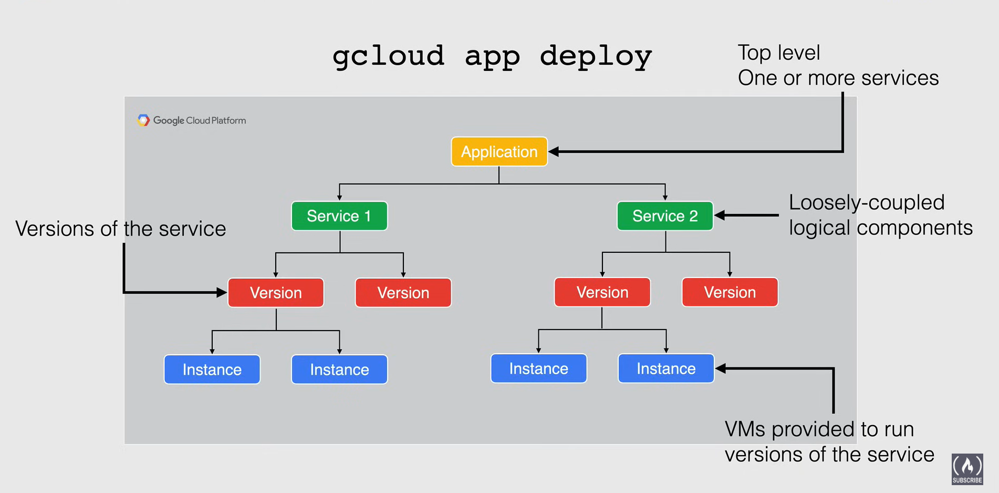

# Serverless Services
## App Engine Overview
- Fully managed, serverless platform for developing and hosting web apps at scale
- PaaS service (Platform as a Service)
    - handles server provisioning and scaling instances with demand
- Launch code or containers (Python, Java, Node.js, Go, Ruby, PHP, .NET)
- Autoscaling based on load (scale up and down and rapid scaling)
- Versions: allows for rollbacks, migration or traffic splitting
    - dev, testing
- Supports connecting to external storage
    - cloud firestore, cloudsql, cloud storage
    - on-prem databases 
    - external db's hosted on other clouds
- 2 flavors:
    - Standard Environment
    - Flexible Environment

#### Standard Environment
- Apps run in a **sandbox environment**
    - app engine can distribute requests across multiple servers
    - scale servers to meet traffic
- Source code written specific **versions** of the supported programming langs
    - Run for free or at a very low cost
        - pay for what you need and when you need it 
- Application can scale to 0 instance when there is no traffic
- Designed for sudden and extreme spikes of traffic that require rapid and immediate scaling
- Pricing is based on instance hours
#### Flexible Environment
- Apps run in docker containers
- Any versions of runtimes used
- No free quota available
- Designed for consistent traffic
- Pricing based on VM resources
- Managed VMs
    - instances health checked, healed, and co-located with other services in the project
    - OS updated automatically
    - VM's are restarted on a weekly basis for security & OS updates

### Deploying an application
- `gcloud app deploy`
    - Automatically builds a container image from your config file using Cloud Build
    - Deploys the image to App Engine
- App Engine Application
    - made up of a single application resource 
    - consists of one or more **Services**
    - each **Service** can be configured to operate with different runtimes or performance settings
- Service
    - loosely coupled logical components
    - Each service contains
        - A deployed **Version** of that service
        - can route traffic to one or more specific Versions of a Service
        - VMs provided run the Versions of the Service

### Managing Instances
- Automatically creates and shut down instances as traffic fluctuates
- You can specify a number of instance to run (regardless of traffic)
- Specify the scaling type (how and when new instances are created)
    - Done through the `app.yaml` file
    - Scaling Types:
        - Automatic Scaling
            - based on metrics like request rate and response latencies
        - Basic Scaling
            - creates instances when your application receives requests
            - good for intermittent workloads or app driven by user activity
            - keeps costs low
        - Manual Scaling
            - specifies the number of instance that continuously run
            - instances to constantly run
            - good for complex startup tasks and applications that require state from memory over time

### Traffic Migration
- Switches the request routing between the **Version** in a **Service**
- You can enable gradual traffic migrations through warmup requests
    - App Engine Flexible migrates traffic immediately

### Traffic Splitting
- used to specify a percentage distribution to spread traffic across 2 or more **Versions** in a **Service**
- Allows A/B testing and control over the pace of rollout of new features

## Intro to Cloud Functions
- Serverless execution environment
    - no need to provision servers or update VMs
    - infra is all handled by Google
    - resource provisioning occurs when app is executed
- Faas -> Function as a Service
- Run in a runtime environment: Python, Java, Node.js, GO, .NET core
- Event driven
    - run based on something happening in your environment 
    - Trigger Types:
        - HTTP, Puv/Sub, Cloud Storage, Firestore, Firebase
- Price -> based on time run + resources provisioned (memory)
    - outbound network requests incur extra fees
- Has a free tier (2 million invocations of your function)

### How Cloud Functions Work
- Select a name and region you want your function to live in
- Select the trigger
    - HTTP, Pub/Sub, Cloud Storage, Firestore, Firebase
- Select authentication config
    - public access or IAM
- Optional Settings:
    - Memory for function, Networking Preferences, Service Account selection
- Select the language and write code
- 2 types of Cloud Functions:
    - HTTP functions
        - invoked from standard HTTP requests
        - GET, PUT, POST, DELETE
    - Background functions
        - used to handle events in the GCP infrastructure
            - ex. messages on a Pub/Sub topic, changes in Cloud Storage Bucket, etc
- Deployment:
    - Bind the trigger to the function
        - only one trigger can be bound to a function at a time
    - Source code is stored in a Cloud Store bucket in a zip file
    - Cloud Build automatically builds a container and pushed to Artifact registry
    - Cloud functions accesses the image to run the container to execute the function

- Functions are not meant to be persistent, nor is the data that is passed on to the function
    - functions are stateless
- Functions have public internet access by default
    - they can also be private, used within VPC but must be configured as such before deployment

- Use Cases:
    - Notifications from an application
    - Database sanitization and maintenance 
        - purge deleted users content
        - deactivate accounts
    - Execute compute heavy tasks in cloud instead of in app
    - Integrations with 3rd party services like 
    
## Cloud Run
- the latest serverless managed compute platform in GCP
- slighly less abstracted from Cloud Functions and made for running containers
- Two ways to run:
    1. Cloud Run Services (ex. responds to req or events)
    2. Cloud Run Jobs (ex. used to perform a job then quits)
- Unique HTTPS endpoint for each service
- Fast req based auto scaling
- 2 pricing models:
    1. Request Based
        - if an instance is not processing requests, the CPU is not allocated, you don't pay
        - pay a per request fee
    2. Instance Based
        - charged for the lifetime of an instance and CPU is always allocated
        - no pre request fee
#### Difference between App Engine
- App Engine resources in the same project must be in the same region, Cloud Run resources in the same project can be in different regions
- Cloud Run you configure CPU, Memory, and Concurrency