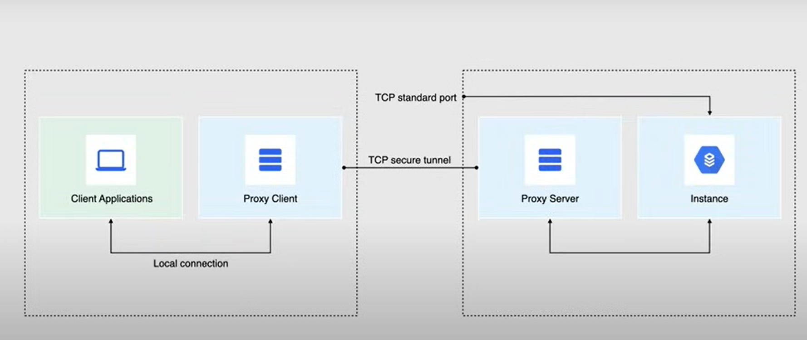
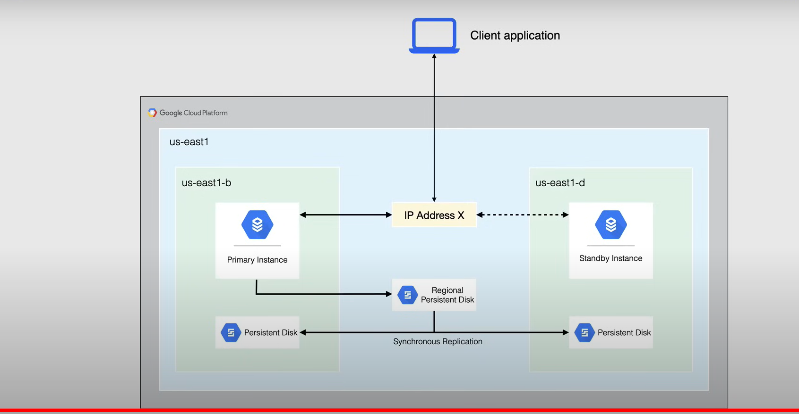

# Storage Services
## Cloud Storage
### Overview
- Consistent, scalable, large capacity, highly durable **object storage**
    - not file or block
    - no minimum object size
    - ex. pictures, videos
- Worldwide accessibility and worldwide storage locations
- Use for data files, text files, pictures, videos
- Excels for content delivery, big datasets, and backups
- Buckets and Objects

### Cloud Storage Buckets
- Basic containers that holds the data
- Used to organize and control access to your data
- Cannot nest buckets
- Must have a **globally unique** name
    - all buckets in single cloud storage namespace
- Specify a geographic location where the bucket and contents stored
    - Region
    - Dual-Region (redundant)
        - use a pair of regions
    - Multi-Region (redundant)
        - use a continent with 2 or more geographic places
    - More Regions = More Availability
- Storage Class
    - Standard
    - Nearline
    - Coldline
    - Archive
- Access Control must be specified
    - IAM (uniform)
    - IAM + ACLs (fine-grained)

### Cloud Storage Objects
- Individual pieces of data or data chunks stored in a Cloud Storage Bucket
- No limit on the number of objects in a bucket
- 2 components:
    1. Object Data
    2. Object Metadata
        - name/value pairs
        - properties: name, storage class, etc
- Flat namespace
    - not a hierarchical filesystem
    - objects have no relationship
- Naming allows you to mimic a hierarchical structure
    - name a file `/dev/version1/image`

### Storage Class
- Effects availability and pricing 
- Storage classes are inherited from the bucket
1. Standard
    - Best for frequently accessed data (short term use)
    - Analytical workloads
    - $0.02/GB/Mo
2. Nearline
    - Low-cost for infrequently accessed data
    - 30 day min storage duration
    - data backup and data archive
    - $0.01 / GB / Mo
    - Pay for data access
3. Coldline
    - Very low-cost for infrequently accessed data
    - 90 day min storage duration
    - data backup and archiving 
    - $0.004 / GB /Mo
    - More expensive data access
4. Archive
    - lowest cost archival storage
    - 365 min storage duration
    - cold data storage / disaster recovery
    - $0.0012 / GB / Mo
    - Expensive data access

### Access Control
- IAM
    - standard IAM permissions
    - permission inherited hierarchically
- Access Control List
    - defines who has access to your bucket and objects
    - what level of access they have
- Signed URLs
    - time-limited read/write access URL
    - access the object for the specified duration
- Signed Policy Documents
    - specify what can be uploaded to a bucket

#### IAM AND ACLs
- these act in parallel for users to access Cloud Storage resources
- IAM is recommended
- ACLs are best for customized access for individual objects in the Buckets
    - Entry in ACL consist of permission and scope
    - ACLs overlap IAM roles

#### Signed URLs
- Access an object using the URL for a duration of time
- Allows users without credentials to perform specific actions on a resource
- Actions are taken as a user or service account
- Do not need account -> just the URL
- `gsutil signurl -d 10m private-key.json <url>`

## Object Lifecycle Management and Versioning
### Versioning
- Objects are immutable (cannot change after upload)
- Objects are never edited in place
    - always replace with a new version
- replacement marked as end of object lifecycle and beginning of a new one
- 2 properties for object version identification
    1. Generation
        - identified the version of the objects data
    2. Metageneration
        - identified the version of the objects metadata
    - enforces the ordering of updates
    - You can restore a replaced Object by referring to an old object 
    - Versioning will cost additional money

###  Object Lifecycle Management
- setting a time to live, retaining non-current versions, downgrading storage class to save costs
- assign a lifecycle management configuration to a bucket
    - contains a set of rules applying to current and futures Object in the bucket 
    - automatically performs the specified action
- Use Case:
    - Delete objects before a date
    - Keep only 3 most recent versioning
    - Downgrade to coldline storage after 365 days of storage
- Configuration:
    - Rules
        - Any set of conditions for any actions
    - Conditions
        - Something an object must meet before the action will occur
        - All conditions must be met for the action to occur
    - Action
        - Delete
            - for current version, it moves to non current state
            - non-current versions are deleted permanently
            - takes highest priority in rules
        - Set Storage Class

### Consideration for Cloud Storage
- Changes are in accordance to object creation date
- once an object is deleted, it cannot be recovered
- Lifecycle rules can take up to 24 hours to take effect
- Test lifecycle rules in development first 

## Cloud SQL
- A fully managed, relational database service (RDBMS)
    - MySQL, Postgres, SQL Server
- DBaaS (Database as a Service)
    - manages OS and database software
- Low latency, transactional, relational DB workloads
- Offers replication - read replicas
- High Availability

- Backups:
    - On Demand
    - Automatic Backups
- Point in time recovery (restore db)
- Runs on connected persistent disks in the same zone
    - up to 30 TB storage capacity

- Automatic storage increase available 
- Encryption at rest and in transit
- Billed for instance, persistent and egress traffic
    - CPU, Memory, Storage and Traffic
- Licensing cost for Windows instances

- Only available in the following CPU types (all marked with db):
    - Shared Core
    - Standard
    - High Memory
- Storage in HDD or SSD
- Connection with public or private IP
    - once configured with private, it cannot be changed
    - private is recommended
- Authentication
    - recommended to use Cloud SQL Proxy (IAM)

### Cloud SQL Proxy
- Allows you to authorize and secure your connections with IAM
- Wraps connection in SSL TLS layer

### Replication
- Use Cases:
    - Scale the use of data in a database without reducing performance
    - Migrate data between regions and platforms
    - Migration from on-prem to Cloud SQL
    - Promote a replica if the original instance becomes corrupted

- There is a primary instance and read replicas
    - read only
    - can have more CPUs and Memory than the primary instance
    - Up to 10 replicas per primary instance

- Types:
    - read replicas
    - cross-region region read replicas
    - external read replicas
        - external mysql instance that replicates from a Cloud SQL primary instance
    - cloud sql replicas when replicating from a external server

- Used to offload work from the primary instance
- Data updates in primary instance almost immediately mirrored in the replica
- Replicas are created in a different zone or region from the primary instance

### Replica Promotion
- If primary db is corrupted or unreachable
- Only can be done with in-region or cross-region replicas
- The replica is converted to a standard Cloud SQL primary instance with Read/Write capabilities
    - Cannot be undone
    - must reconnect other replicas to new primary instance
    - this is done manually and intentionally
- 2 uses:
    - Regional migration (planned)
    - Disaster Recovery (unplanned)

### High Availability 
- Provides redundancy
- Has a regional instance located in a primary and secondary zone
- Components:
    - Primary Instance
    - Secondary Instance
- A heartbeat is sent from the primary instance, if it is unresponsive the workload fails over to the secondary instance
- Standby instance shares a static IP address to begin serving requests
- Failback occurs when primary instance is back online
- A HA configured instance is charged at double the price (CPU, Memory)

### Backups
- Allow you to restore lost data to a Cloud SQL instance
- Enabled for any instance that contains necessary data 
- Required for Clone and Replica creation
- Stores backups in 2 regions
    - one in the same region as the Cloud SQL instance
    - stays on the same continent
- 2 types of Backups:
    1. On-demand
        - created at any time
        - persist until you delete or instance is deleted
    2. Automated
        - 4 hour backup window
        - Occur everyday
        - 7 most recent backups retained
        - Configurable retention
- Point in time Recovery (PITR):
    - Recover instance at a specific point in time
    - Always creates a new instance
    - Enabled by default

## Cloud Spanner
- Similar to CloudSQL but has different ways the underlying data is handled
### Overview
- Fully managed relational db service that is both strongly consistent and horizontally scalable
- DBaaS (Database as a Service)
- Strongly Consistent:
    - data is passed to all replicas as soon as soon as a write request comes to one of the replicas of the db
- Supports schemas, ACID transaction, and SQL queries
- Globally distributed 
- Handles replicas and sharding (fully managed)
- Synchronous data replication
- Automatic scaling and node redundancy
- Up to 99.999% availability
    - for multi-regional instances
- Offers data layer encryption, audit logging, and IAM integration
- Designed for financial services, ad tech, retail and global supply chain, and gaming
- Price: $0.90 /node/hr + $0.30/GB/mo

### Difference between Cloud SQL
#### Instances
- Must create Cloud Spanner Instance
- 2 choices:
    - instance config
    - node count
- config is permanent, node count can be changed
- Maintains 3 R/W replicas (fully db copies)
    - across 3 regions
    - 3 node configuration minimum recommended
- Cloud Spanner splits dbs with sharding for increased performance
#### Performance
- Provides up to 10000 queries per second of reads or 2000 QPS of writes
- 2 TB of storage per node
- Addtl nodes increase data throughput and QPS
- Scale nodes automatically w/ Cloud functions from Cloud Monitoring metrics as trigger

## NoSQL Databases
### Cloud Big Table
- Fully managed, wide-column NoSQL db designed for TB to PB scale workloads
- Low latency, High Throughput
- Uses:
    - Built for real time application serving workloads
    - Large scale analytics
    - large amounts of single keyed data
    - Time Series Data
    - Marketing Data
    - Financial Data
    - IoT Data
    - Graph Data
    - Storage for ML apps
- Automatic replication
- Regional Service
- Cluster resizing (to handle large workload)
- Ideal for MapReduce Operations
- Integrations:
    - hadoop
    - dataproc
    - datadflow
    - apache hbase
- High Price

### Cloud Firestore
- flexible, scalable NoSQL db for mobil, web and server development
- document db
- automatic multi-region data replication
- strongly-consistent queries
- atomic batch operations
- transaction support
- offline support

### Memory Store
- Fully managed in-memory `Redis` or `Memcached` service that offers sub ms access, scalability, and high availability
- Build application caches
- Use Cases: 
    - Caching, Gaming, Stream Processing 
