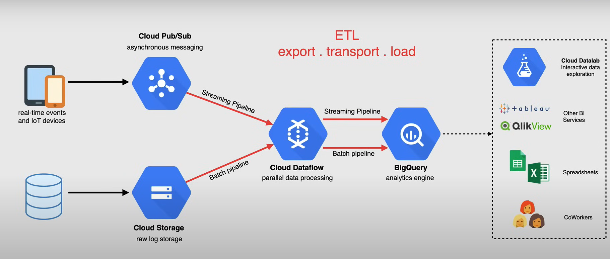
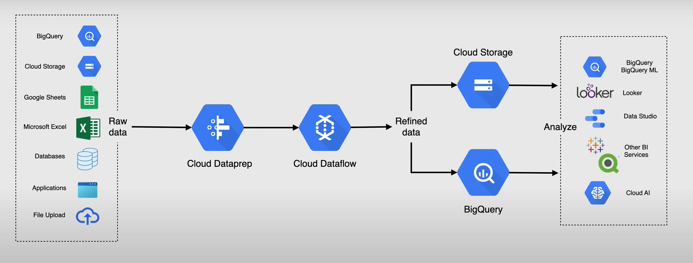

# Big Data and ML
## Big Data Services
### Characteristic of Big Data
- Massive amounts of data that would traditionally be too expensive to store, manage and analyze
- Traditional dbs are not cost effective
- No flexibility for storing unstructured data
- Cannot accommodate real time data
- Lack support for PB scale data volumes
- Apache Hadoop and NoSQL DBs created
    - complex to deploy and manage on-prem
- Allows for better machine learning 

### Big Query
- fully managed enterprise data warehouse
- Uses:
    - ML, Geospatial Analysis, BI
- Uses SQL queries
- Integrates with Big Data Ecosystem (hadoop, spark)
- two layers:
    - storage layer: ingests, stores, optimizes (ELT)
    - compute layer: provide analytics capabilities
- the separation of layers allows dynamic allocation of resources for Read/Write independently
- Federated queries allow you to read from external sources
- Streaming supports continuous data updates
- Query TBs in seconds, PBs in minutes

### Pub / Sub
- Fully managed, real-time messaging service that allows you to send and receive messages between independent applications
- Messaging orienting middleware
- Publisher Application: created an send messages to a topic
- Subscribers: subscribe to a particular topic and receiving messages for that topic
- Topic: a named entity that represents a feed of messages 
- Use cases:
    - balancing large task queues
    - distributing event notifications
    - real time data streaming

### Composer
- Managed workflow orchestration service built on Apache Airflow
- Workflow automation tool for developers
- Deploys multiple components to run Airflow in the Cloud
- Programmatically author, schedule, and monitor workflows
- A workflow represents a series of tasks for ingesting, transforming, and analyzing data
    - created using DAGs
        - collection of tasks you want to schedule and run

### Dataflow
- fully managed processing service for executing Apache Beam pipelines for batch and realtime data streaming
- Apache Beam SDK
    - open-source programming model to develop batch and streaming pipelines
- High level: reads data from source, transforms it, writes it back to a sync
- Low Level:
    - Dataflow reads data from data source
    - Put into collection of datasets called PCollection
    - Transformation done
    - PCollection
    - Written to a sync

Dataflow Job with other services in Google Cloud

### Dataproc
- fully managed Spark and Hadoop service
    - Spark, Hadoop, Pig, Hive
- can be used to replace on-prem Hadoop infra
- fast, integrated, managed
- 1 cent/ vCPU

### Dataproc vs Dataflow
- Both can be used for ETL Data warehousing 
- Dataproc
    - managed
    - spin up clusters and turn off when not needed
    - Good if you have dependencies to tools in Hadoop ecosystem 
- Dataflow 
    - serverless
    - Apache Beam runtime
    - If you want different execution engines

### Cloud Datalab
- interactive developer tool for:
    - data exploration
    - analysis
    - visualization
    - machine learning
- Best for data science task
- Integrations with BigQuery and other things
- Allows you to execute code with notebooks

### Cloud Dataprep
- Intelligent data service for visually exploring, cleaning, and prepping structured data for analysis, reporting and machine learning 
- Automatically detects schemas, data types, potential joins, and anomalies

Potential Architecture w/ Dataprep

### AI Services
- VertexAI 
- Translation
- DocumentAI
- Speech
- VertexAI Vision (image models)

