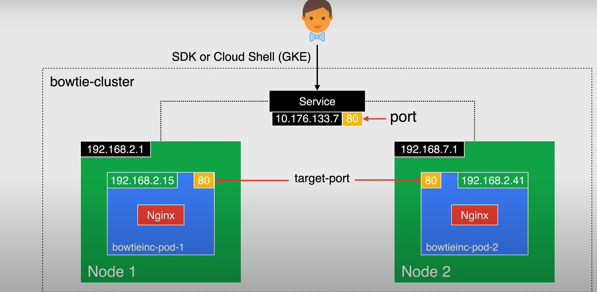

# Kubernetes Engine and Containers
## Intro to Containers
- Containerization is a OS level virtualization or a application-level virtualization over multiple network resources so software applications can run in isolated spaces called *containers* in any cloud or non-cloud environments
- These are much more overhead in CPU, memory, and disk than VMs
- Docker Image Breakdown:
    - A image is a collection or stack of layers created by sequential instructions in a dockerfile
    - each line in the dockerfile creates a new layer
    - ex. Base Image (FROM), Installed Software (RUN), Working Directories (ENV), Expose (EXPOSE), Command (CMD)
    - These are all read only layers
- A running docker container is an instantiation of an image
    - containers using the same image are identical to each others
    - running containers include a writeable layer
    - containers will have the Read/Write layers
- Container Registry
    - a single place for you to store and manage docker images
    - ex. DockerHub
- Docker Hosts
    - any machine running a docker engine

## GKE and Kubernetes Concepts
- Google Cloud's PaaS (Platform-as-a-Service) offering for containers
### What is Kubernetes
- an orchestration platform for containers
- a platform to automate, schedule, and run containers on physical or virtual machines
### What is GKE
- a managed environment for Kubernetes
- abstracted the complexity of having to worry about the hardware
- has clustered management features
    - cloud load balancing
    - automatically scaling
    - node pools (designate subnets of nodes in a cluster)
    - automatic upgrades (for node software)
    - node auto-repair
    - logging and monitoring
### Cluster Architecture
- Control Plane
    - responsible to coordinate the entire cluster
    - scheduling and managing
    - manages network and storage resources
    - manages the state of the cluster
    - Endpoint for the cluster
    - Components:
        - `kube-apiserver` -> Point of interaction with the cluster
        - `kube scheduler`-> discovers and assigns newly created pods
        - `kube controller manager` -> runs all controller processes
        - `cloud controller manager` -> runs controllers specific to the cloud provider
        - `etcd` -> stores the state of the cluster
            - a highly available key value store 
- Nodes 
    - worker machines that run the containerized applications
    - compute engine VM instances 
    - each node is responsible for Docker runtime
    - Components:
        - `kubelet` -> agent for communication with the Control Plane
        - `kube-proxy` -> maintains network connectivity to the pods
        - `runtime` -> runs the containers
- For GKE, you get the Cluster IP that points to the Control Plane

## Cluster and Node Management
- choosing different cluster types, cluster versions, node pools, etc
### Node Pools
- a group of nodes within a cluster that all have the **same** configuration
- contain one or multiple nodes
- custom node pools are good for pods that require more resources
    - you cannot configure a single node in a node pools
- existing node pools can be manually or automatically upgraded

### Cluster Types
- Zonal
    - Single Zone
        - single Control Plane in one zone
    - Multi-Zonal
        - single replica of the Control Plane in a single zone 
        - has nodes running in multiple zones
        - workloads still run if Control Pane zone is down
        - same num of nodes deployed to each zone
- Regional: for high availability
    - has multiple replicas of the Control Plane running in multiple zones with nodes in each zone
    - consumes more CE resources (more expensive)
    - defaults to 3 zones
- Private Clusters
    - useful when dealing with sensitive info with strict guidelines
    - ability to isolate nodes from having inbound and outbound access
        - nodes have internal IP addresses only
        - use Cloud NAT for outbound connection
    - the Control Plane VPC network network is connected to the cluster's VPC network via VPC peering
        - Control Plane and Cluster (nodes) are separately by VPC networks

### Cluster Version
- when creating a cluster you can choose the Kubernetes version or mix versions
- recommended to enable auto-upgrade for cluster and nodes
- Release Channels
    - Google manages the version and upgrade cadence 
    - 3 types:
        - Rapid
            - latest kubernetes release as soon as possible
            - access to the newest possible features
        - Regular (default)
            - 2-3 months after releasing in Rapid
        - Stable
            - 2-3 months after releasing in Regular
- You can also run a specific version Kubernetes for a given workload

### Cluster Upgrades
- Control Plane and nodes do not always run on the same version at all times
- A control plane is always upgrades before it's nodes
    - Zonal-> cannot launch or edit workloads during upgrade
    - Regional -> each control plane is upgrade one by one
- Auto Upgrade is enabled by default (best practice)
- Manual Upgrade -> cannot upgrade control plane more than one minor version at a time
- Maintenance windows and exclusions are available

### Node and Node Pool Upgrades
- Auto-upgrade enabled by default 
- Manual upgrade available
- Maintenance window and exclusion available
- Pods scheduled to run on another node during upgrades
- Upgrade Complete when:
    - All nodes have been recreated
    - Cluster is in the desired state

### Surge Upgrades
- Control the number of nodes GKE can upgrade at a time
- Use surge upgrade parameters
- reduces disruptions of your workload during cluster maintenance
- allow you to control the number of nodes upgrades in parallel
- 2 settings:
    - `max-surge-upgrade`
        - the number of addtl nodes added to the node pool during an upgrade
        - Higher number = more parallel upgrades (more cost)
    - `max-unavailable-upgrade`
        - num of nodes that can be simultaneously unavailable during an upgrade
        - higher number = more disruptive
- During upgrade, GKE brings down at most (`max-surge-upgrade + max- unavailable-upgrade`)

## Pods and Object Management
### Kubernetes Objects
- Kubernetes Objects are persistent entities
    - Represent the state of your cluster
        - ex. what containerized apps are running on which nodes, what resources are available to those apps
    - A record of intent, tells Kubernetes what you want your clusters workload to look like
        - The clusters desired state
    - Contains 2 fields:
        - Object Spec
            - set on object creation
            - desired state described by you
        - Object Status
            - current state described by kubernetes 

### Manifest File
- For Creating, Updating, or Deleting Kubernetes Objects
- You specify the desired state of the object for when you apply the manifest
- Each config file can contain multiple manifests
- defined in the form of JSON or YAML (recommended)

Sample Manifest
```yaml
apiVersion: v1
kind: Pod
metadata:
    name: webserver
spec: 
    containers:
    - name: webserver
        image: nginx:latest
        ports:
        - containerPort: 80
```

- apiVersion -> the version of the Kubernetes API
- kind -> the kind of object you want to create
- metadata -> identifies the object (name, UID, namespace)
- spec -> the desired state for this object

### Pod Concepts
- smallest most basic deployable objects in Kubernetes
- a single instance of a running process in your container
- contain one or more containers (such as docker)
- when a pod runs multiple containers, they are managed as a single entity and share resources
    - shared networking and shared storage
- Controllers manage the lifecycle of Pods and hormonally scale the Pods
- After Pod creation, it is then run on a Node
    - Remains on Node until:
        - Pod process complete
        - Pod deleted
        - Pod evicted due to lack of node resources
        - Node failure

### Namespaces
- defined as in the "kind" field of the manifest
```yaml
apiVersion: v1
kind: Namespace
metadata:
    name: test
    namespace: <your namespace>
```
- a single GKE cluster should be able to satisfy the needs of multiple users or groups of users
- Namespaces help different projects, teams, or customers share the cluster 
- You can name them whatever you like
- Kubernetes has 4 initial namespaces:
    - `default`
        - objects with no other namespace, auto assigned
    - `kube-system`
        - object created by kubernetes
    - `kube-public`
        - created automatically and readable by all users
        - reserved for cluster usage
    - `kube-node-lease`
        - lease objects associated with each node, to improve performance

### Labels
- Key/Value pairs to help you organize your resources
```yaml
apiVersion: v1
kind: Deployment
metadata:
    name: nginx-deployment
    labels:
        app: webserver
        env: testing
```

### Pod Lifecycle
- ephemeral
    - not designed to run forever
- when terminated, it cannot be brought back
- do not disappear until deleted by user or controller
- do not heal or repair themselves

```
O ---- PENDING -----> RUNNING -----> SUCCEEDED ----- O
                                 |                   |
                      UNKNOWN    |--- FAILED --------|

```

- pending -> initial pod phase for container to start
- running -> at least one container in the pod is running
- succeeded -> all containers in the pod have terminated successfully
- failed -> one or more containers have terminated unsuccessfully
- unknown -> state of the pod could not be obtained

### Creating Pods
- to create a Pod, using a deployment is a good way to do this 
```yaml
apiVersion: extensions/v1beta1
kind: Deployment
metadata:
    name: nginx-deployment
spec:
    replicas: 3
    template:
        metadata: 
            labels:
                app: nginx
        spec: 
            containers:
            - name: nginx
            image: nginx:latest
```
- a deployment runs multiple replicas of the application
- automatically replaces instances that fail
- ensure one or more instances of the app are available to server user requests
- the template is the specifications for the pod

- a **deployment** is a higher level concept that manages replica sets and provides updates to pods

### Workloads
- Objects that sets deployment rules for pods
- define the rules for application scheduling, scaling, and upgrading

#### Types of Workloads
- **Deployments** -> best for stateless apps
- **Stateful Sets** -> used for apps that require persistent storage
- **DaemonSets** -> ensures every node in the cluster runs a copy of that Pod
- **Jobs** -> used to run a finite task until completion (no ongoing applicaitons)
- **CronJobs** -> runs until completion on a schedule
- **ConfigMaps** -> configuration info for other workloads to reference

## Kubernetes Services
- Determines how you want to route traffic in your Kubernetes cluster
### Kubernetes approach to networking
- Pods are ephemeral
    - resources are never permanent
- each Pod gets it's own IP address
    - a Pod that is destroyed and recreated gets a new IP
    - cannot keep track of all the new IPs

### What is a service?
- Goal is provide persistent access to Pods without having to search for IPs
- A abstraction
- a logical set of Pods that provides:
    - a persistent single IP address and DNS name
    - allows routing external traffic 
    - used inside cluster for better routing
    - manages load balances
    - automatically scales (handles new pod creation and new IPs)

### Service Components
- fields in the manifest determine traffic endpoints (for routing)
service.yaml
```yaml
apiVersion: v1
kind: Service
metadata:
    name: clusterip-service
spec: 
    selector:
        app: inventory
    type: ClusterIP
    ports:
    - protocol: TCP
    port: 80
    targetPort: 80
```

- metadata->name: the DNS name of the service
- selector->label: Forwards requests to pods with this label
    - requests will be forwarded to pods with label app:inventory
- type-> the type of service it is
- port-> port number exposed internally to cluster
- targetPort -> port that containers are listening on


### Selectors and Labels
- Services select Pods based on their label


### Service Types
Different services for routing network traffic withing GKE 

- ClusterIP
- NodePort
- LoadBalancer
- Ingress
- Multi-port Services
- ExternalName
- Headless

#### ClusterIP
- creates a stable IP that is accessible from nodes within the cluster
- clients withing the cluster call the service using the IP and Port specified in the manifest 


ClusterIP Manifest
```yaml
apiVersion: v1
kind: Service
metadata:
    name: clusterip-service
spec: 
    selector:
        app: inventory
    type: ClusterIP
    ports:
    - protocol: TCP
    port: 80
    targetPort: 80
```

#### NodePort
- NodePort is a static port and is chose from a pre-configured range
    - between 30,000 and 32,767
    - a static port is a port that does not change
- The service is accessible externally using any Node IP address with the NodePort value
- **Note:** this is an extension of the ClusterIP type
- Not secure as it opens each node to external entry
    - also requires knowledge of the node IP which can change at any time


NodePort Manifest
```yaml
apiVersion: v1
kind: Service
metadata:
    name: nodeport-service
spec: 
    selector:
        app: inventory
    type: NodePort
    ports:
    - protocol: TCP
      port: 80
      targetPort: 80
      nodeport: 32002
```

#### Load Balancer
- Exposed as a LB in the cluster
- Creates the internal Kubernetes service connected to a Cloud Load Balancer
- Created a static public IP and DNS to access the cluster from external source
- You pay for each Load Balancer (more expensive)


LoadBalancer Manifest
```yaml
apiVersion: v1
kind: Service
metadata:
    name: loadbalancer-service
spec: 
    selector:
        app: inventory
    type: LoadBalancer
    ports:
    - port: 80
      targetPort: 80
```

#### Multi-port
- Addresses the need to expose multiple ports
- Lets you configure multiple ports on a service object
    - names must be unique


MultiPort Manifest
```yaml
apiVersion: v1
kind: Service
metadata:
    name: multiport-service
spec: 
    selector:
        app: inventory
    type: LoadBalancer
    ports:
    - name: Nginx
      protocol: TCP
      port: 80
      targetPort: 80
    - name: App-B
      protocol: TCP
      port: 9752
      targetPort: 9752
```

#### External Name
- provides an internal alias for an external DNS name
- internal clients make requests using the internal DNS name
- requests are redirected to the external name


ExternalName Manifest
```yaml
apiVersion: v1
kind: Service
metadata:
    name: <internal DNS name>
spec: 
    type: ExternalName
    externalName: <external DNS name redirect> 
```

#### Headless
- If you do not need or want Load Balancing and a single service IP
- Specify None as the service type in the manifest
- Used Case:
    - when you dont need load balancing or routing
    - the service just needs to patch the request to the backend pod
    - Stateful Applications: databases or clustered software that requires stable identities
    - Rolling Updates: want to apply changes or updates to one pod at a time


```yaml
apiVersion: v1
kind: Service
metadata:
    name: headless-service
spec: 
    selector: 
        app: inventory
    type: None
    ports:
    - protocol: TCP
      port: 80
      targetPort: 80 
```

## Ingress for GKE
- Object to define rules for routing traffic to specific Services
    - HTTP and HTTPS traffic to applications running in the cluster
- Associated with one or more Service object
    - Each Service object is associated with one or more Pods

- GKE Ingress controller creates a HTTP(S) load balancer 
    - Load Balancer is given a stable IP address which can be associated with a domain name
- Uses a single URL map which references one or more backend Service
- The most powerful way to expose your service but can be quite complex

- Most useful/cost effective if you want to expose multiple service under the same IP address
    - you only pay for one load balancer (with native GCP integration)


ingress.yaml
```yaml
apiVersion: networking.k8s.io/v1beta1
kind: Ingress
metadata:
  name: ingress-net
spec: 
  rules:
  - http:
      paths:
      - path: /*
        backend:
          serviceName: products
          servicePort: 80
      - path: /discontinued
        backend:
          serviceName: discontinued
          servicePort: 80
```

- **EACH SERVICE HAS ITS OWN INDEPENDANT MANIFEST**
product-service.yaml (NodePort)
```yaml
apiVersion: v1
kind: Service
metadata:
    name: products
spec: 
    selector:
        app: products
    type: NodePort
    ports:
    - protocol: TCP
      port: 80
      targetPort: 80
```

discontinued-service.yaml (NodePort)
```yaml
apiVersion: v1
kind: Service
metadata:
    name: discontinued
spec: 
    selector:
        app: discontinued
    type: NodePort
    ports:
    - protocol: TCP
      port: 80
      targetPort: 21337
```

### Network Endpoint Groups (NEG)
- a config object that specifies a group of backend endpoints or services
- Useful where each container can be represented as a endpoint to the LB
- used to track Pod endpoints dynamically  


### Health Checks
- Default and inferred parameters are used if there are no specified health check params
- Should be explicitly defined by using a Backend Config custom resource definition (CRD)
    - should be done if using:
        - Anthos Ingress controller
        - x > 1 container 
        - Specified port for LB health check
- healthCheck parameter of a BackendConfig CRD referenced by the Service

### SSL Certificated
- 3 way to provide certs to HTTP(S) Load Balancer
    1. Google-managed
        - completely managed by Google
        - Do not support wildcard domains
    2. Self-managed
        - Managed and shared with Google Cloud
        - Provision your own
        - List the certificate in annotation for use (on Ingress)
    3. Self-managed as Secrets
        - Provision your own certificated
        - Create a secret to hold the certificate
        - Refer to the secret for use

## GKE Storage Options
### Overview
- Google Cloud provides several storage options for GKE
- NAS (Network Attached Storage)
| Database      | NAS       | Object Store  | Block Storage   |
|---------------|-----------|---------------|-----------------|
| Cloud SQL     | Filestore | Cloud Storage | Persistent Disk |
| Cloud Spanner |           |               |                 |
| Data Store    |           |               |                 |

- We want to understand Kubernetes Storage Abstractions in the context of Docker
### Docker Storage
- Volumes: a directory on disk or another container
    - Docker provides Volume drivers
- A docker container has a writable layer where info is stored
    - Data is ephemeral
- 3 ways to mount data in Docker Container:
    1. Docker Volume:
        - sits in the docker area in the host filesystem
        - can be shared among other containers 
    2. Bind Mount
        - comes directly from host filesystem
        - good for local app development
        - cannot be shared across containers
    3. tmpfs
        - stored in the host memory
        - good for ephemeral data
        - increases performance
        - not in the containers writable layer

### Kubernetes Storage Abstractions
- Volumes:
    - the basic storage unit that decouples the storage from the container and tie it in the Pod
    - basically a directory that the containers in the Pod have access to 
    - Volume Type determines it's usage:
        - Ephemeral Storage
            - caching temporary info
            - sharing files between containers
            - load data to a pod
        - Persistent Volumes (Durable Storage)
            - persist beyond the lifetime of the Pod
            - A persistent volume claim dynamically provisions a persistent volume

### Types of Volumes
1. emptyDir
    - empty directory that containers in the Pod can read and write from
    - stored on whatever medium is backing the node
        - ex. Disk, SSD, or NAS
    - Use:
        - scratch space
        - sharing data between multiple containers in a Pod
2. ConfigMap
    - provides a way to inject configuration data into Pods
3. Secret
    - used to make sensitive data available to applications
        - passwords, OAuth Tokens, SSH keys
4. Downward API
    - used to make Downward API data available to application
    - Use:
        - to expose information about the Pod namespace and IP to applications
5. PersistentVolumeClaim
    - provision durable storage to be used by applications
    - mount a volume backed by the durable storage

### Persistent Volume
- used to manage durable storage in a cluster
- typically backed by a Persistent Disk 
    - Filestore can be used as a NFS solution (Network File System)
- lifecycle is managed by Kubernetes
    - can be dynamically provisioned
- persist independently of Pods

### Persistent Volume Claims
- a request for and claim to a persistent volume resource
- request a specific size, access mode, and storage class
- Pods use claims as volumes

### Storage Classes (kind in Manifest)

Sample Manifest
```yaml
apiVersion: storage.k8s.io/v1
kind: StorageClass
metadata: 
  name: standard
provisioner: kubernetes.io/gce-pd
parameters:
  type: pd-standard
  fstype: ext4
  replication-type: none
reclaimPolicy: Retain
allowVolumeExpansion: true
mountOptions:
  - debug
volumeBindingMode: Immediate
```

- fstype: the default storage class
- reclaimPolicy: retain -> prevents persistent volume deletion

### Persistent Volume Access
- 3 Access Modes
    1. ReadWriteOnce
        - mounted as read-write by a single node
        - most common for use cases (default)
    2. ReadOnlyMany
        - mounted as read only by many nodes
    3. ReadWriteMany
        - mounted as read write by many nodes

- 2 persistent disks
    1. Regional Persistent Disks
        - multi-zonal resources 
        - replicate data between 2 zones
        - can fail over workloads
        - good for highly available, stateful workloads on GKE
    2. Zonal Persistent Disk
        - unless a Zone is specified, it is assigned at random
        - Pods referencing the disk are scheduled to the same zone

- Speed of Access
    - the size of persistent disks determine the IOPS and Throughput
    - GKE typically uses persistent disks at boot disks and back Kubernetes persistent volumes
    - Use larger and fewer disks for higher IOPS


## DEMO Commands
- Accessing the cluster after creation:
    - `gcloud container clusters get-credentials <cluster name> --zone <zone name>`
- Cloud Build -> use for building images
- Artifact Registry -> Googles system for storing images


